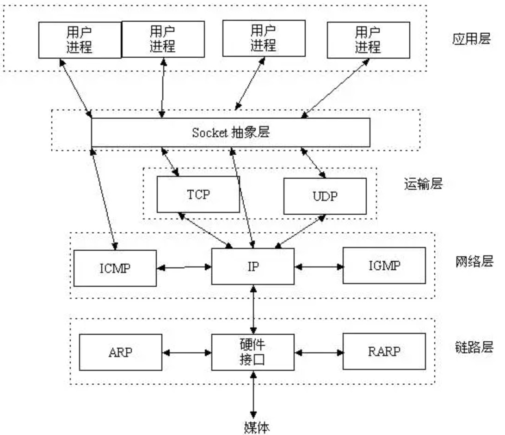
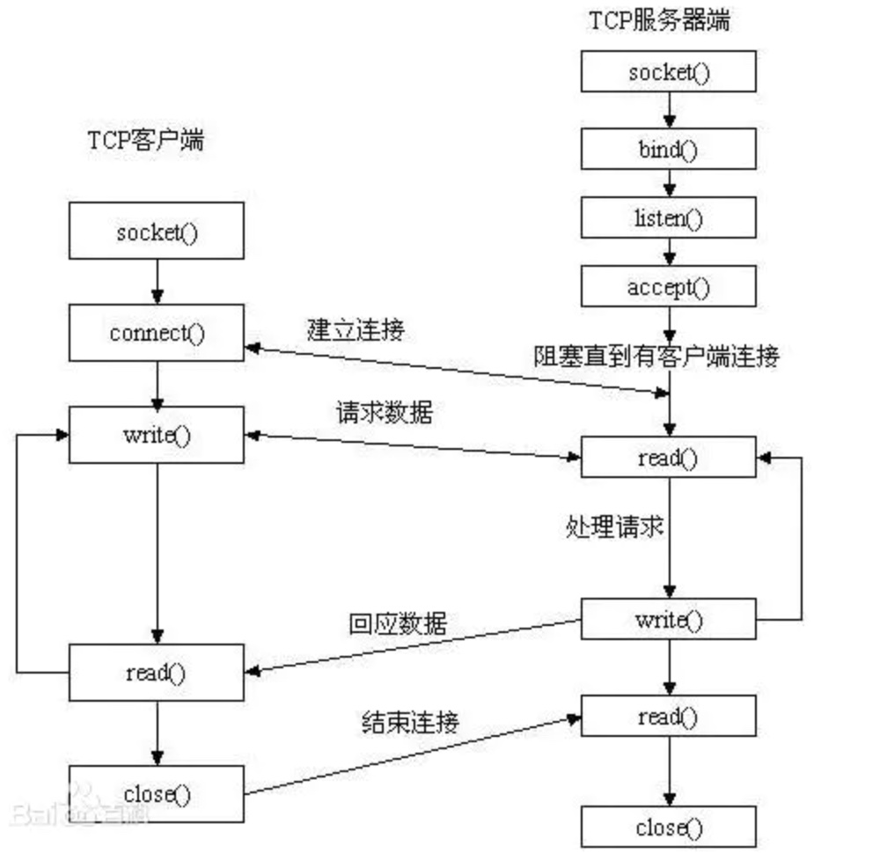

# socket的位置、api、调用流程

Socket 其实并不是一个标准的协议，而是应用层与 TCP/IP 协议族通信的中间软件抽象层，它是一组接口，工作位置基本在 OSI 模型会话层（第5层），是为了方便大家直接使用更底层协议（一般是 TCP 或 UDP ）而存在的一个抽象层。
在设计模式中，Socket其实就是一个门面（facade）模式，它把复杂的 TCP/IP 协议族隐藏在 Socket API 后面，对用户来说，一组简单的接口就是全部，让 Socket 去组织数据，以符合指定的协议

